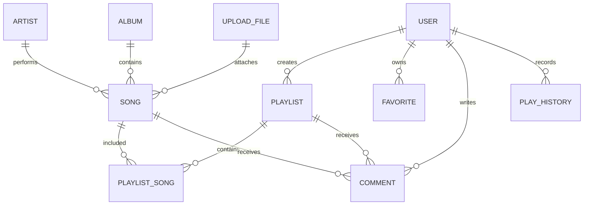

# 步骤一 ER 与 API 初稿

## 1. 数据模型总览



## 2. 核心表字段草案

### user

|字段|类型|说明|
|-|-|-|
|id|bigint|主键。|
|username|varchar(50)|用户名，唯一。|
|password_hash|varchar(255)|密码哈希，不保存明文。|
|nickname|varchar(50)|昵称。|
|avatar_url|varchar(500)|头像 URL。|
|role|varchar(20)|`USER` / `ADMIN`。|
|status|tinyint|1 正常，0 禁用。|
|created_at|datetime|创建时间。|
|updated_at|datetime|更新时间。|

### artist

|字段|类型|说明|
|-|-|-|
|id|bigint|主键。|
|name|varchar(100)|歌手名。|
|bio|varchar(1000)|简介。|
|avatar_url|varchar(500)|头像 URL。|
|created_at|datetime|创建时间。|
|updated_at|datetime|更新时间。|

### album

|字段|类型|说明|
|-|-|-|
|id|bigint|主键。|
|title|varchar(100)|专辑名。|
|artist_id|bigint|歌手 ID。|
|cover_url|varchar(500)|封面 URL。|
|release_date|date|发行日期，可为空。|
|created_at|datetime|创建时间。|
|updated_at|datetime|更新时间。|

### song

|字段|类型|说明|
|-|-|-|
|id|bigint|主键。|
|title|varchar(100)|歌名。|
|artist_id|bigint|歌手 ID。|
|album_id|bigint|专辑 ID，可为空。|
|cover_url|varchar(500)|封面 URL。|
|audio_url|varchar(500)|音频 URL。|
|lyric_url|varchar(500)|歌词 URL，可为空。|
|duration_seconds|int|歌曲时长，单位秒。|
|language|varchar(20)|语言。|
|genre|varchar(50)|风格。|
|mood|varchar(50)|情绪或场景标签。|
|play_count|bigint|播放量。|
|status|tinyint|1 上架，0 下架。|
|created_at|datetime|创建时间。|
|updated_at|datetime|更新时间。|

### playlist

|字段|类型|说明|
|-|-|-|
|id|bigint|主键。|
|user_id|bigint|创建者 ID。|
|title|varchar(100)|歌单名。|
|description|varchar(500)|描述。|
|cover_url|varchar(500)|封面 URL。|
|visibility|varchar(20)|`PUBLIC` / `PRIVATE`。|
|play_count|bigint|播放量。|
|favorite_count|bigint|收藏量。|
|created_at|datetime|创建时间。|
|updated_at|datetime|更新时间。|

### playlist_song

|字段|类型|说明|
|-|-|-|
|id|bigint|主键。|
|playlist_id|bigint|歌单 ID。|
|song_id|bigint|歌曲 ID。|
|sort_order|int|歌单内顺序。|
|created_at|datetime|添加时间。|

### favorite

|字段|类型|说明|
|-|-|-|
|id|bigint|主键。|
|user_id|bigint|用户 ID。|
|target_type|varchar(20)|`SONG` / `PLAYLIST`。|
|target_id|bigint|收藏目标 ID。|
|created_at|datetime|收藏时间。|

### comment

|字段|类型|说明|
|-|-|-|
|id|bigint|主键。|
|user_id|bigint|用户 ID。|
|target_type|varchar(20)|`SONG` / `PLAYLIST`。|
|target_id|bigint|评论目标 ID。|
|content|varchar(1000)|评论内容。|
|status|tinyint|1 正常，0 隐藏。|
|created_at|datetime|创建时间。|
|updated_at|datetime|更新时间。|

### play_history

|字段|类型|说明|
|-|-|-|
|id|bigint|主键。|
|user_id|bigint|用户 ID。|
|song_id|bigint|歌曲 ID。|
|progress_seconds|int|最近播放进度。|
|source_type|varchar(30)|首页、搜索、歌单、推荐等来源。|
|played_at|datetime|播放时间。|

### upload_file

|字段|类型|说明|
|-|-|-|
|id|bigint|主键。|
|owner_id|bigint|上传者 ID。|
|file_type|varchar(20)|`AUDIO` / `COVER` / `LYRIC` / `AVATAR`。|
|original_name|varchar(255)|原始文件名。|
|storage_path|varchar(500)|存储路径。|
|url|varchar(500)|访问 URL。|
|mime_type|varchar(100)|MIME 类型。|
|size_bytes|bigint|文件大小。|
|created_at|datetime|上传时间。|

## 3. 索引与约束草案

|表|索引或约束|用途|
|-|-|-|
|user|unique(username)|登录和防重复注册。|
|song|index(title), index(artist_id), index(album_id), index(status)|歌曲搜索、详情和列表过滤。|
|playlist|index(user_id), index(visibility), index(play_count)|我的歌单、公开歌单和热门歌单。|
|playlist_song|unique(playlist_id, song_id), index(playlist_id, sort_order)|防重复添加和歌单排序。|
|favorite|unique(user_id, target_type, target_id)|防重复收藏。|
|comment|index(target_type, target_id, created_at)|歌曲/歌单评论列表。|
|play_history|index(user_id, played_at)|最近播放和轻量推荐。|

## 4. 统一响应草案

所有 JSON API 使用统一结构：

```json
{
  "code": 0,
  "message": "ok",
  "data": {},
  "timestamp": "2026-06-29T22:00:00+08:00"
}
```

约定：

- `code = 0` 表示成功。
- 非 0 表示业务、参数、权限、资源或系统错误。
- 分页接口的 `data` 包含 `items`、`page`、`size`、`total`。

## 5. P0/P1 API 初稿

### Auth / User

|方法|路径|优先级|功能|
|-|-|-|-|
|POST|`/api/auth/register`|P0|注册普通用户。|
|POST|`/api/auth/login`|P0|登录并返回 Token 或会话凭证。|
|POST|`/api/auth/logout`|P0|退出登录。|
|GET|`/api/users/me`|P0|获取当前用户信息。|
|PUT|`/api/users/me`|P1|修改昵称、头像等资料。|

### Music

|方法|路径|优先级|功能|
|-|-|-|-|
|GET|`/api/songs`|P0|歌曲分页列表，默认只返回上架歌曲。|
|GET|`/api/songs/{id}`|P0|歌曲详情。|
|GET|`/api/search`|P0|综合搜索歌曲、歌手、专辑、歌单。|
|POST|`/api/songs/{id}/play-record`|P1|记录播放历史。|
|GET|`/api/artists`|P1|歌手列表。|
|GET|`/api/albums`|P1|专辑列表。|

### Playlist

|方法|路径|优先级|功能|
|-|-|-|-|
|GET|`/api/playlists`|P0|公开歌单分页列表。|
|POST|`/api/playlists`|P0|创建歌单。|
|GET|`/api/playlists/{id}`|P0|歌单详情。|
|PUT|`/api/playlists/{id}`|P0|修改自己的歌单。|
|DELETE|`/api/playlists/{id}`|P0|删除自己的歌单。|
|POST|`/api/playlists/{id}/songs`|P0|向歌单添加歌曲。|
|DELETE|`/api/playlists/{id}/songs/{songId}`|P0|从歌单移除歌曲。|
|PUT|`/api/playlists/{id}/songs/order`|P2|拖拽排序后保存顺序。|

### Favorite / Comment

|方法|路径|优先级|功能|
|-|-|-|-|
|POST|`/api/favorites`|P1|收藏歌曲或歌单。|
|DELETE|`/api/favorites`|P1|取消收藏。|
|GET|`/api/comments`|P1|按歌曲或歌单查询评论。|
|POST|`/api/comments`|P1|发布评论。|
|DELETE|`/api/comments/{id}`|P1|删除自己的评论；管理员可删除任意评论。|

### Admin

|方法|路径|优先级|功能|
|-|-|-|-|
|GET|`/api/admin/dashboard`|P1|后台统计面板。|
|POST|`/api/admin/upload`|P0|上传音频、封面、歌词。|
|POST|`/api/admin/songs`|P0|新增歌曲。|
|PUT|`/api/admin/songs/{id}`|P0|编辑歌曲。|
|PATCH|`/api/admin/songs/{id}/status`|P0|上架或下架歌曲。|
|GET|`/api/admin/users`|P1|用户列表。|
|PATCH|`/api/admin/users/{id}/status`|P1|启用或禁用用户。|
|GET|`/api/admin/comments`|P1|评论管理列表。|
|PATCH|`/api/admin/comments/{id}/status`|P1|隐藏或恢复评论。|

## 6. 后续 schema.sql 生成规则

- 数据库脚本在步骤二创建，文件建议放在 `music-web-backend/src/main/resources/db/schema.sql`。
- 表名使用小写下划线。
- 时间字段统一使用 `created_at`、`updated_at`。
- 涉及用户输入的评论、昵称和描述字段必须在后端校验长度，在前端展示时转义。
- 歌曲删除优先使用下架状态，不物理删除，避免歌单历史断链。
